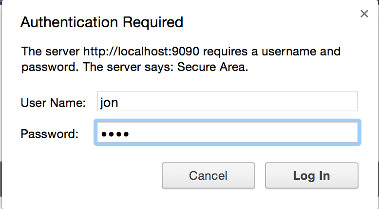

# Elemental HTTP Server

### Basic HTTP Server that reads from and writes to fs

## Security Notice !!!

This server will expose some serious security vulnerabilities.  
Do not run this in production, or leave it running on your local environment that is accessible from the public network.  
## Resources

- [NodeJS http module](https://nodejs.org/api/http.html)
- [NodeJS fs module](https://nodejs.org/api/fs.html)
- [NodeJS querystring module](https://nodejs.org/api/querystring.html)

## Goals

Use `http.createServer` to create an instance of `http.Server`

The http server will serve html and css content that is stored on the file system. Each resource will be identified by it's corresponding file name. Store all resources in a `public/` sub directory.

for example:

```
├── README.md
├── public
│   ├── css
│   │   └── styles.css
│   ├── helium.html
│   ├── hydrogen.html
│   └── index.html
└── server.js
```

If an http request asks for `/hydrogen.html`, then respond with the contents of `public/hydrogen.html`.

_see the routing table below_

## POST Requests

An HTTP Client can issue POST Requests to a specific route identified by the uri `/elements`.  
The POST Body will contain content of type `application/x-www-form-urlencoded`.  
The HTTP Server will parse the form data, and save a file in the designated public directory, based on that content.  
The form data will be:

| Name                | Content                                                             |
|---------------------|---------------------------------------------------------------------|
| elementName         | the Titlecased name of the element to be saved, for example "Boron" |
| elementSymbol       | the element Symbol, for example: "B"                                |
| elementAtomicNumber | the element's atomic number, for example: 5                         |
| elementDescription  | a short description                                                 |

Use Postman to perform POST Requests with the proper form fields.

_see the routing table below_

Parse the request body, and write a new file (if it does not exist), to the public directory, named after the element's name, appended with the `html` file extension.

using the above example POST data, [this file](https://gist.github.com/theRemix/1da546c72ac66844617d) will be saved to `./public/boron.html`  
_notice the areas of **dynamic data**, title tag, h1 tag, h2 tag, etc._

In other words, when a client performs a POST request with the 4 required post data fields, a new file will be created in a valid html5 format, containing the dynamic content from the post data fields.

The http server will respond to the POST request with an http response code 200, content type of `application/json`, and content body of `{ "success" : true }`

## GET Requests

The http server will respond to GET requests, and serve the contents of the public directory, serving each public file by it's name as the uri.

As new html pages are created, more content will be available.

If a resource path (url) does not exist, return a 404 response code and render the html contents of `404.html`

### Auto Updating Index

Each time a new resource is created (via POST), update the `index.html` file to reflect the newly created page.

When `carbon.html` is been added to the `public/` directory, add a link to `carbon.html` in `public.html`.

## Initial Routing Table

| HTTP | Path            | File                  |
|------|-----------------|-----------------------|
| GET  | /               | public/index.html     |
| GET  | /hydrogen.html  | public/hydrogen.html  |
| GET  | /helium.html    | public/helium.html    |
| GET  | /404.html       | public/404.html       |
| GET  | /css/styles.css | public/css/styles.css |
| POST | /elements       | -                     |

[Get your initial file contents from here](https://gist.github.com/theRemix/d926c96cb01c3465c98c)

---

## Advanced

### PUT Request

The http server can accept PUT requests to paths of resources that exist, example: `/hydrogen.html`

The PUT request contains a body similar to the POST request fields.

_for your convenience, require all 4 fields be set to update the html file_

| Name                | Content                                                             |
|---------------------|---------------------------------------------------------------------|
| elementName         | update the name of the element in the html document to this value |
| elementSymbol       | update the element Symbol in the html document to this value |
| elementAtomicNumber | update the element's atomic number in the html document to this value |
| elementDescription  | update the short description                                                 in the html document to this value |

If the requested path to update does not exist, return a 500 server error, content type `application/json`, and content body of `{ "error" : "resource /carbon.html does not exist" }` (for example)

If the http PUT request successfully updates the requested html file, respond to the PUT request with an http response code 200, content type of `application/json`, and content body of `{ "success" : true }`

### DELETE Request

The http server can accept DELETE requests to paths of resources that exist, example: `/hydrogen.html`

The DELETE request contains no body.

If the requested path to delete does not exist, return a 500 server error, content type `application/json`, and content body of `{ "error" : "resource /carbon.html does not exist" }`

If the http DELETE request successfully deletes the requested html file, respond to the DELETE request with an http response code 200, content type of `application/json`, and content body of `{ "success" : true }`

---

## 2Advanced

### HTTP Basic Auth

#### Resources

[Buffer](https://nodejs.org/api/buffer.html#buffer_new_buffer_str_encoding)

#### Goals

Use HTTP Basic Auth to protect the sensitive aspects of your server, POST, PUT, DELETE requests by requiring a correct username and password.

Check if the `authorization` header is present in the request, if it is not, require authorization (using Basic Auth) by sending a status code of 401, sending a response with a header of `WWW-Authenticate` with a value of `Basic realm="Secure Area"` and ending the request by responding with a body of `<html><body>Not Authorized</body></html>`




If the `authorization` header is present, decode and compare against your own internal valid login credentials.  
To decode the `authorization` header, extract the value of the `authorization` header by removing the first part of the authorization header value.

Example authorization header value:  
```
Basic Y2hhcmxlczoxMjM0NQ==
      ^------------------^--> only need this string
```

this string is Base64 encoded, decode it

```
var encodedString = 'Y2hhcmxlczoxMjM0NQ==';
var base64Buffer = new Buffer(encodedString, 'base64');
var decodedString = base64Buffer.toString();
```

**decodedString** will be the username password pair separated by a colon `:`  
```
console.log(decodedString);
// username:password
```

extract the username and password from the decodedString, then compare against some stored username and password stored somewhere in memory.

**Security Consideration Notice**  
_You will be committing your code to a public github repository, where anyone can see your source code which will contain your secret username and password... so use caution and set it to some fake test credentials__

If the username and password match your secret values, allow the client to perform their requested operation.

If the username and password do not match your secret value, force them to attempt authentication again by sending a 401 status code, `WWW-Authenticate` header, and ending the request by responding with a body of `<html><body>Invalid Authentication Credentials</body></html>`

As long as the client continues to send the correct authorization header values, they do not need to keep re-authenticating. This is easily done in Postman.


